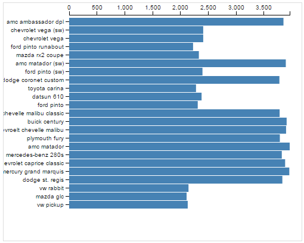

Building a Nice Bar Chart
=========================

We've just learned some of the basic features of D3
for building HTML elements and processing data.
In this tutorial, we will use some data that we've loaded
about Twitter hashtags to build a simple bar chart:



This visualization just shows the number of times each hashtag
was used over a given time interval.

1. Drawing a Visualization
--------------------------

How do we get from our hashtag data to a visualization?
Once we've loaded the data, we have to use D3 to draw a bunch of stuff
on the screen. Here are the basic steps we'll be following:

1. Read the data from CSV.
2. Create an SVG element to hold the visualization.
3. Define x and y scales.
4. Draw the x and y axes and labels.
5. For every hashtag in the data:
    1. Draw an SVG `<rect>` element
    2. Set the `y` position
    3. Set the width based on frequency

We already talked about loading data. You can review the code for
this in the JavaScript panel to the right, if you wish.
We have also already entered some CSS to make the bar chart look nice.

<a class="btn btn-primary jsbin-button" href="http://jsbin.com/rogab/64/edit?js,output" target="_blank">Open Initial Setup in JS Bin</a>

In the following sections, we will go through each of the steps above.


2. Create an SVG element
------------------------

Let's add an SVG element to the page.
We'll also decide at this point how big we want to draw our visualization.

```javascript
var width = 500;
var height = 400;
var svg = d3.select('body')
  .append('svg')
  .attr('width', width)
  .attr('height', height);
```

This code uses `d3.select` to locate the `<body>` HTML element
and adds an `<svg>` element to it.
It then sets the `<svg>` element's `width` and `height` attributes
using variables.

You should see a box with a thin gray border appear.

<a class="btn btn-primary jsbin-button" href="http://jsbin.com/rogab/65/edit?js,output" target="_blank">Open in JS Bin</a>


The bar chart visualization of is complete. Below is a live copy:

<iframe class="embed-visualization" height="430" width="530" src="resources/barchart/barchart.html"></iframe>

<a class="btn btn-primary jsbin-button" href="http://jsbin.com/rogab/63/edit?js,output" target="_blank">Open in JS Bin</a>
