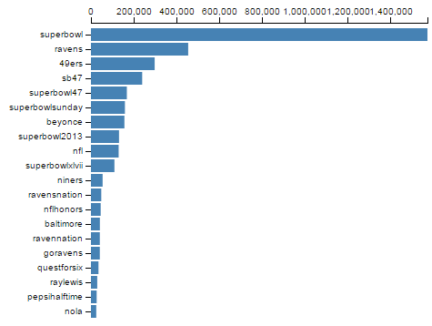

Build a Bar Chart
====================

In this tutorial, we will use the Cars dataset to build a simple bar chart.
This will let us review some important D3 concepts, like
scales and axes and the "data join".

<div class="alert alert-danger">TODO: Replace with real screenshot"</div>



This bar chart simply shows the weight of each car.


1. The Cars Dataset
----------------

The "Cars" dataset used in this tutorial is a subset
of the 1983 ASA Data Exposition dataset that is used in the [HCDE 511](http://courses.washington.edu/hcde511/) course.

You can [download the data](resources/cars/carsExercise.xls) in Excel format, although
it is not necessary to complete the tutorial.

Every row in the data represents an individual type of car.
The dataset includes the following fields:

- Model: the car's model name
- Origin: the country where the car is from
- Year: the year the car was manufactured
- Cylinders: the number of cylinders in the car's engine
- Horsepower: how powerful the car's engine is
- MPG: how many miles per gallon the car gets (fuel efficiency)
- Weight: how much the car weighs, in lbs.


1. Drawing a Visualization
--------------------------

How do we get from our cars data to a visualization?
Once we've loaded the data, we have to use D3 to draw a bunch of stuff
on the screen. Here are the basic steps we'll be following:

1. Read the data from CSV.
2. Create an SVG element to hold the visualization.
3. Define x and y scales.
4. Draw the x and y axes and labels.
5. For every car in the data:
    1. Draw an SVG `<rect>` element
    2. Set the `y` position
    3. Set the width based on frequency

You can review the code for loading the CSV data
in the JavaScript panel to the right.

<a class="btn btn-default jsbin-button" href="http://jsbin.com/pamago/1/edit?js,output">Open in JS Bin</a>

We have also already entered some CSS to make the bar chart look nice.
In the following sections, we will go through each of the steps above.


2. Create an SVG element
------------------------

Let's **add an SVG element to the page** to hold our visualization.
We also need to decide the size of the SVG when we create it.

<a class="btn btn-default jsbin-button" href="http://jsbin.com/pamago/1/edit?js,output">Open in JS Bin</a>

The `width` and `height` variables below will determine how big to draw the bar chart.
Add the following to your JavaScript:

```javascript
var width = 500;
var height = 400;
```

Now, we ask d3 to create the SVG element and set its width and height:

```javascript
var svg = d3.select('body')
  .append('svg')
  .attr('width', width)
  .attr('height', height);
```

#### Chaining Syntax

The snippet above shows *chaining*, which is a pattern that most d3 programs use
to get lots of stuff done in a small number of lines:

1. `d3.select` locates the `<body>` HTML element in the page and returns the
   `<body>` element as its result.

2. Onto that result, we *chain* a call to `append('svg')`.
   This creates an `<svg>` element as a child of the `<body>` element,
   and returns the `<svg>` that was created.

3. Onto the returned `<svg>` element, we chain two calls
   to `attr()` to set the `<svg>` element's
   `width` and `height` attributes using our two variables.

For more about chaining, try [this tutorial](http://alignedleft.com/tutorials/d3/chaining-methods).

<div class="testing">
After adding the above code, you should see a box with a thin gray border appear
in the output.
</div>

<div class="explore">
Try changing the two width and height variables and check that you see the rendered SVG change sizes.
</div>


3. Define the x and y scales
----------------------------

How do we convert from numbers in the data to visual variables, like
color, position, or size?

#### Example

1. We will map the *weight* variable in the cars dataset to bar *width*.
2. The maximum weight in the dataset is **3,962 lbs**.
3. We want the largest bar in the chart to be **500 pixels** wide.
4. Then, to determine the bar width for a car of **2,100 lbs.**,
   we calculate **500 * 2,100 / 3,962 = 265 pixels**.
5. Draw a bar that is 265 pixels wide.

This math isn't especially complex, when your variables can be categorical, times, or
when your visual variables might be colors, things can get more complicated.

#### D3 Scales

D3 provides some special utilities called [scales](https://github.com/mbostock/d3/wiki/Scales)
to make these conversions easier:

- [Quantitative Scales](https://github.com/mbostock/d3/wiki/Quantitative-Scales) for continuous values.
    - linear scales: `d3.scale.linear()`
    - log scales: `d3.scale.log()`
    - power scales: `d3.scale.power()`
- [Ordinal Scales](https://github.com/mbostock/d3/wiki/Ordinal-Scales) for discrete values.
    - basic ordinal scales: `d3.scale.ordinal()`
    - color scale shortcuts: `d3.scale.category10()`
- [Time Scales](https://github.com/mbostock/d3/wiki/Time-Scales) for mapping time values.
    - multi-level time scales: `d3.time.scale()`

In this tutorial, we'll use `d3.scale.linear()` to map from
car **weight** onto bar width. We'll also use `d3.scale.ordinal()`
to map car **model** to vertical position for the bar.


### Find the domains

Before we can figure out how to map car weight onto
bar width, we need to know the maximum weight in the data.

We already know it is 3,962 lbs., but D3 can calculate it for us.

<a class="btn btn-default jsbin-button" href="http://jsbin.com/pamago/2/edit?js,console">Open in JS Bin</a>

Add the following code:

```javascript
var max_weight = d3.max(data, function(d) {
  return d.weight;
});
```

This snippet shows how you can use D3 for **iterating over data**:

1. The `d3.max` function goes through all of the cars in `data`.
2. For each car, the provided "accessor" function is executed
   with the parameter `d` being the current car.
3. The accessor returns the current car's weight.
4. The `max` function returns the largest weight of all the cars.

This pattern is common in JavaScript even beyond d3.
For more examples, see the following documentation:

* [Array iteration with forEach()](https://developer.mozilla.org/en-US/docs/Web/JavaScript/Reference/Global_Objects/Array/forEach)
* [jQuery iteration with each()](http://api.jquery.com/jquery.each/)
* [D3's array functions](https://github.com/mbostock/d3/wiki/Arrays)

Each car in the dataset will be allocated one vertical position in the chart for its bar.
The vertical position will be determined based on the car's model name, so before
we continue we will also need to extract a list of all of the model names in the data:

```javascript
var model_names = data.map(function(d){
  return d.model;
});
```

The `map()` function is built in to JavaScript and is not d3-specific.
See the [documentation on MDN](https://developer.mozilla.org/en-US/docs/Web/JavaScript/Reference/Global_Objects/Array/map)
for details.

<div class="testing">
<ol>
    <li>Open the *Console* view on JSBin and click **Run**.</li>
    <li>Type **max_weight** in the Console and press Enter. You should see the result **3962**.</li>
    <li>For **model_names**, you should see an array of all the car models.</li>
</div>

<div class="explore">
<ol>
    <li>Calculate the maximum **horsepower** in the dataset (190).</li>
    <li>In addition to the max, find the **minimum** weight - *[Hint](https://github.com/mbostock/d3/wiki/Arrays#d3_min)*.</li>
</ol>
</div>


### Construct the scales

Now that we know the max of `weight` and the
car models in our data, we are ready to create D3 scales
that will help us draw our bars.

<a class="btn btn-default jsbin-button" href="http://jsbin.com/pamago/3/edit?js,output">Open in JS Bin</a>

Let's start by constructing the **x scale**.

[D3 scales](https://github.com/mbostock/d3/wiki/Quantitative-Scales)
are simply functions that map one set of values onto
another set of values. Borrowing terms from algebra,
the input values are called the *domain*,
and the output values are called the *range*.

In our case, the x scale will be a function that maps
values from the domain of `[0, max_weight]` onto the range `[0, width]`.
Add the following JavaScript to build the scale:

```javascript
var x = d3.scale.linear()
  .range([0, width])
  .domain([0, max_weight]);
```

The `d3.scale.linear()` function returns a Scale object, but this
object is actually callable just like a function.

<div class="testing">
<p>Try entering the following commands into the Console window and check the result:</p>
<table class="table table-condensed">
    <tr><th>Command</th><th>Expected result</th>
    <tr><td>x(0)</td><td>0 (pixels)</td></tr>
    <tr><td>x(max_weight)</td><td>500</td></tr>
    <tr><td>x(2100)</td><td>265.0176</td></tr>
</table>
</div>

<div class="explore">
Try changing the domain and range for the x scale and see how it affects
the results above.
</div>

Next, we will create an *ordinal* scale that maps car model
names onto vertical positions for the bars.
The ordinal scale divides the space between 0 and `height`
up into the proper number of bins given number
of car models we are going to visualize:

```javascript
var y = d3.scale.ordinal()
  .domain(model_names)
  .rangeRoundBands([0, height], 0.1);
```

We are using a magic D3 function called `rangeRoundBands()` that
ensures your bars get spaced out correctly. You can read more on the
[D3 documentation](https://github.com/mbostock/d3/wiki/Ordinal-Scales#ordinal_rangeRoundBands).

<div class="testing">
<p>You can call the y scale like a function to get the vertical position for different car models.</p>
<p>In the Console, type **y("ford pinto")** and press Enter. You should see **175** (pixels).</p>
</div>


4. Draw the axes
-----------------

Now we're ready to draw the bar chart axes.
If you think about it, there is a lot of stuff that goes into
axes. There are several lines and some labels, and they all have to get
positioned correctly based on the data and the size you are drawing them.

D3 provides special "axis rendering" utilities
specifically for drawing axes. This can save you a ton of work.
You just have to give it a scale (like you've already created), tell it
whether it is drawing on the top, bottom, left, or right
of your chart, and it does the rest for you.

<a class="btn btn-default jsbin-button" href="http://jsbin.com/pamago/4/edit?js,output">Open in JS Bin</a>

The code below initializes an axis "renderer":

```javascript
var xAxis = d3.svg.axis()
  .scale(x)
  .orient("top");
```

We can then use the renderer to draw the SVG elements
that make up the axis with this code:

```javascript
svg.append("g")
  .classed("x axis", true)
  .call(xAxis);
```

**But where is the axis?**

You might see a small black line at the top of the SVG panel.
If you use the debugger to inspect the SVG element, you'll see that
it actually does contain new markup for the axis elements.
Unfortunately, they are off screen!

Elements rendering in the wrong place is a common problem with D3.
We'll fix that in the next step by adding some space
around the outside of our visualization.


### Add margins

We want to draw our visualization a little bit inside
the outside of the SVG element.
To do this, we need to *back up* a little bit and
change the way we set up the visualization.

<a class="btn btn-default jsbin-button" href="http://jsbin.com/rogab/67/edit?js,output">Open in JS Bin</a>

First, **find the code** where you start to define the x and y scales
(look for `var x = ...`). Right **before** that section, add the following:

```javascript
var margins = {
  top: 20,
  right: 20,
  bottom: 50,
  left: 110
};
var graphWidth = width - margins.right - margins.left;
var graphHeight = height - margins.top - margins.bottom;

var chart = svg.append('g')
  .attr('transform', 'translate(' + margins.left + ',' + margins.top + ')');

//this goes before you start to define the scales...
```

This sets up the margin sizes and adds a new SVG `<g>` (grouping) element
to the drawing. It also *transforms* the group element by shifting it
left and down using the margin sizes we configured above.
We will hang all of the visualization elements off this element.

Now we need to update a few other things now as well:

**Use graphWidth and graphHeight:** Look immediately below this, where you
define the scales (`var x =` and `var y =`).

In this section, you must replace `width` and `height`
with `graphWidth` and `graphHeight`, respectively.

**Append to chart:** Further down, find the code where you draw the x-axis.
Instead of using `svg.append`, you should change it to `chart.append`.

Finally, you should see your x-axis miraculously appear in view!


### Add the other axis

Ok, now we need to add the y-axis.
The code for this is very similar to what we used for the x-axis, so why don't you try this yourself?

<a class="btn btn-default jsbin-button" href="http://jsbin.com/rogab/68/edit?js,output">Open in JS Bin</a>

Note: you won't see a long black line for the y-axis like you do for the x-axis.
This is because of some special CSS styles that we added to make the chart look better.

If you get stuck, you can always click the JS Bin button in the next
section to skip ahead to the answer.
