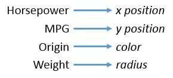

Visualizing the Cars Data
=========================

In this tutorial we will build a colorful scatter-plot-style visualization.
We will use four dimensions from the Cars dataset, encoded as x and y position, size, and color.

The Cars Dataset
----------------

The "Cars" dataset used in this tutorial is a subset
of the 1983 ASA Data Exposition dataset that is used in the [HCDE 511](http://courses.washington.edu/hcde511/) course.

You can [download the data](resources/cars/carsExercise.xls) in Excel format, although
it is not necessary to complete the tutorial.

Every row in the data represents an individual type of car.
The dataset includes the following fields:

- Model: the car's model name
- Origin: the country where the car is from
- Year: the year the car was manufactured
- Cylinders: the number of cylinders in the car's engine
- Horsepower: how powerful the car's engine is
- MPG: how many miles per gallon the car gets (fuel efficiency)
- Weight: how much the car weighs, in lbs.

Visual Encodings
----------------

We will create a visualization of four of these fields.
The visual encodings are illustrated in the diagram below:



Here is a screenshot of the final visualization:


1. Initial Setup
-------------

We'll skip over some of the basic setup for the visualization,
which we already covered in other tutorials.
Here are the steps we are skipping:

1. Importing the data from the CSV.
2. Creating the SVG element.
3. Defining scales for the data fields.
4. Drawing the chart axes.

<a class="btn btn-primary jsbin-button" href="http://jsbin.com/xexezo/8/edit?js,output" target="_blank">Open Initial Setup in JS Bin</a>

You can review the code for these in the JavaScript panel to the right, if you wish.
We have also provided some CSS to make the chart look nice, but we won't go into it here.


2. Draw some dots
-----------------

Our first step will be to render a dot for each car, using SVG `<circle>` elements.

[More about circles](https://developer.mozilla.org/en-US/docs/Web/SVG/Element/circle)


First, we select all of the elements with class 'dot' (they are theoretical
dat this point) and bind the cars data to them.

Add the following code to the bottom of the JavaScript in JS Bin:

```javascript
var dots = chart.selectAll('.dot')
                .data(data);
```

Next, use the D3 data join function `enter()`
to create a dot for every dot that doesn't yet exist.
For the cars data, this means 26 dots.

```javascript
dots.enter()
    .append("circle")
    .attr("class", "dot")
    .append("title");
```

*Note that we also added an SVG `<title>` element inside each dot,
which we will use later to show a tooltip.*

This doesn't do anything in our visualization, but
it is normal at this point to also remove any dots that you don't need:

```javascript
dots.exit().remove();
```

Now there are dots being rendered, but they don't look like anything.
They have default size, color, and position.

<a class="btn btn-primary jsbin-button" href="http://jsbin.com/xexezo/9/edit?js,output" target="_blank">Open in JS Bin</a>


Mapping to visual attributes
----------------------------

To actually see our dots, we need to set their position, size,
and color.

To do this, we just add the following code:

```javascript
dots.attr("r", function(d) { return radius(d.weight); })
    .attr("cx", function(d) { return x(d.horsepower); })
    .attr("cy", function(d) { return y(d.mpg); })
    .style("fill", function(d) { return color(d.origin); });
```

In the initial setup, we prepared several D3 "scale" objects
that we are using here (`radius`, `x`, `y`, and `color`).
You can scroll up through the JavaScript to find how
these are defined.

<a class="btn btn-primary jsbin-button" href="http://jsbin.com/xexezo/4/edit?js,output" target="_blank">Open in JS Bin</a>


Adding scales
-------------

