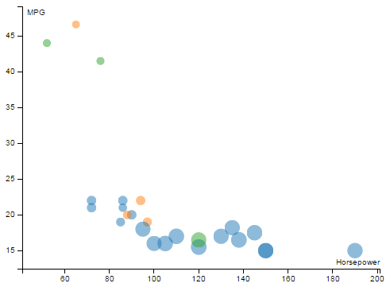

Visualizing the Cars Data
=========================

In this tutorial we will build a colorful scatter-plot-style visualization.
We will use four dimensions from the Cars dataset, encoded as x and y position, size, and color.

1. The Cars Dataset
----------------

The "Cars" dataset used in this tutorial is a subset
of the 1983 ASA Data Exposition dataset that is used in the [HCDE 511](http://courses.washington.edu/hcde511/) course.

You can [download the data](resources/cars/carsExercise.xls) in Excel format, although
it is not necessary to complete the tutorial.

Every row in the data represents an individual type of car.
The dataset includes the following fields:

- Model: the car's model name
- Origin: the country where the car is from
- Year: the year the car was manufactured
- Cylinders: the number of cylinders in the car's engine
- Horsepower: how powerful the car's engine is
- MPG: how many miles per gallon the car gets (fuel efficiency)
- Weight: how much the car weighs, in lbs.


2. Visual Encodings
----------------

We will create a visualization of four of these fields.
The visual encodings are illustrated in the diagram below:


Here is a screenshot of the final visualization:


3. Initial Setup
-------------

We'll skip over some of the basic setup for the visualization,
which we already covered in other tutorials.
Here are the steps we are skipping:

1. Importing the data from the CSV.
2. Creating the SVG element.
3. Defining scales for the data fields.
4. Drawing the chart axes.

<a class="btn btn-default jsbin-button" href="http://jsbin.com/xexezo/8/edit?js,output">Open in JS Bin</a>

You can review the code for these in the JavaScript panel to the right, if you wish.
We have also provided some CSS to make the chart look nice, but we won't go into it here.


4. Draw some dots
-----------------

Our first step will be to render a dot for each car, using SVG `<circle>` elements
([documentation about circles](https://developer.mozilla.org/en-US/docs/Web/SVG/Element/circle)).
That means we are going through the data join again.
It has the same *select*, *append*, *remove*, *update*
steps here as it did in the bar chart visualization.

<a class="btn btn-default jsbin-button" href="http://jsbin.com/xexezo/8/edit?js,output">Open in JS Bin</a>

First, we select all of the elements with class 'dot' (they are theoretical
dat this point) and bind the cars data to them.

Add the following code to the bottom of the JavaScript in JS Bin:

```javascript
var dots = chart.selectAll('.dot')
                .data(data);
```

Next, use the D3 data join function `enter()`
to create a dot for every dot that doesn't yet exist.
For the cars data, this means 26 dots.

```javascript
dots.enter()
    .append("circle")
    .attr("class", "dot")
    .append("title");
```

*Note that we also added an SVG `<title>` element inside each dot,
which we will use later to show a tooltip.*

This doesn't do anything in our visualization, but
it is normal at this point to also remove any dots that you don't need:

```javascript
dots.exit().remove();
```

Now, there are dots being rendered, but they don't look like anything.
They have default size, color, and position.
To actually see our dots, we need to set their position, size,
and color.

To do this, we just add the following code:

```javascript
dots.attr("r", function(d) { return radius(d.weight); })
    .attr("cx", function(d) { return x(d.horsepower); })
    .attr("cy", function(d) { return y(d.mpg); })
    .style("fill", function(d) { return color(d.origin); });
```

In the initial setup, we prepared several D3 "scale" objects
that we are using here (`radius`, `x`, `y`, and `color`).
You can scroll up through the JavaScript to find how
these are defined.


6. Adding a legend
---------------

The chart as is stands is pictured below:



This is all very nice, but how is a user to know what is meant by size and color?
To make things more clear, we'll now add a legend to the chart, in the upper
right corner. Here's what we're going for:


We are going to use D3 to build this legend dynamically,
just like we are doing with our actual visualization.
That means we are going to do *another* data join!

<a class="btn btn-default jsbin-button" href="http://jsbin.com/xexezo/4/edit?js,output">Open in JS Bin</a>

The data for the "legend visualization" will be the list of
car origins (`['US', 'Japan', 'Europe']`), which we can obtain
by calling `color.domain()` because origins are the domain
for our color scale.

We'll build up the legend in stages. First,
add the following code:

```javascript
var origins = chart.selectAll(".legend.origin")
  .data(color.domain())
  .enter().append("g")
  .attr("class", "legend origin")
  .attr("transform",
        function(d, i) { return "translate(0," + i * 20 + ")"; });
```

This joins the list of car origins to a "theoretical"
set of `.legend` and `.origin` elements.
Because these elements don't exist yet,
they will be created.
We also offset (translate) each part of the legend
by about 20 pixels so that they don't all appear on top of each other.

Now we have a bunch of empty and invisible `<g>` elements with
their class attribute set to 'legend origin'.
The code below attaches a rectangle of the appropriate color to each
one of these `<g>` elements:

<pre data-line="5"><code class="language-javascript">origins.append("rect")
      .attr("x", graphWidth - 18)
      .attr("width", 18)
      .attr("height", 18)
      .style("fill", color);
</code></pre>

Finally, we will use similar code to add the text labels:

<pre data-line="6"><code class="language-javascript">origins.append("text")
      .attr("x", graphWidth - 24)
      .attr("y", 9)
      .attr("dy", ".35em")
      .style("text-anchor", "end")
      .text(function(d) { return d; });
</code></pre>

A lot of that was just moving stuff around to make it look good.
The highlighted `.style()` the `.text()` lines are what
actually produce the color and text labels from the car origins data.


7. Another legend
--------------

We also want to clearly explain what the size of dots means.

<a class="btn btn-default jsbin-button" href="http://jsbin.com/xexezo/5/edit?js,output">Open in JS Bin</a>

This mostly similar to the legend above:

```javascript
var legendOffset = origins.size() * 20 + 5;

//Add a legend for radius/weight
var weights = chart.selectAll('.legend.weight')
  .data(range.weight)
  .enter().append('g')
  .attr('class', 'legend weight')
  .attr('transform', function(d, i) { return "translate(0, " + (legendOffset + i * 20) + ")"; });

weights.append("circle")
  .attr("cx", graphWidth - 9)
  .attr("cy", 10)
  .attr("r", radius)
  .style("fill", 'gray');

weights.append("text")
  .attr("x", graphWidth - 24)
  .attr("y", 9)
  .attr("dy", ".35em")
  .style("text-anchor", "end")
  .text(function(d) { return d + " lbs"; });
```

The only new thing here is that we have added a `legendOffset` to start
drawing this legend below the first legend.


8. Interactivity
-------------

Let's add a little bit of interactivity so that we can see how
to listen and respond to mouse events with D3.

<a class="btn btn-default jsbin-button" href="http://jsbin.com/xexezo/10/edit?js,output">Open in JS Bin</a>

As you'll see if you move your mouse over the dots and the color legend,
we have already added code to make the elements brighten when
the mouse is hovering over them. This is all done in CSS.

What if we wanted the blue dots to light up when the user
moves their mouse over the "US" part of the legend?

Add the code below:

```javascript
//Link the legend to the dots
origins.on('mouseover', function(origin) {
  dots.classed('brushed', function(d) {
    return d.origin == origin;
  });
})
```

Now, when the `mousover` event fires on one of the legend items,
the dots with a matching value for the `origin` field will
have their class set to `brushed`.

Unfortunately, you'll also notice that if you move your mouse
out of one of the legend boxes, the highlighting doesn't go away.
To fix this, add the following directly below the code you just added:

```javascript
.on('mouseout', function(origin) {
  dots.classed('brushed', false);
});
```

Linking the legend to the data is good, but what about the reverse?
We can use a similar procedure to make the legend light up when
the user hovers over a dot:

```javascript
dots.on('mouseover', function(d) {
  origins.classed("brushed", function(origin) {
    return d.origin == origin;
  });
})
.on('mouseout', function(d) {
  origins.classed("brushed", false);
});
```

Here we go:

<a class="btn btn-default jsbin-button" href="http://jsbin.com/xexezo/11/edit?js,output">Open in JS Bin</a>

Congratulations!
---------------

The visualization of the cars dataset is complete. Below is a live copy:

<iframe class="embed-visualization" height="430" width="530" src="resources/cars/cars.html"></iframe>
