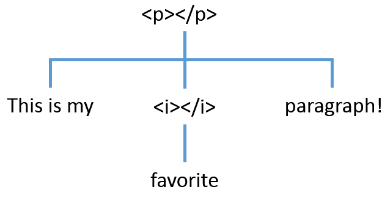

Beginning with HTML
===================

So you're interested in learning HTML? Great! 
This guide is designed to help you get started. It is intended for people with little or no HTML experience.


What is HTML?
-------------

HTML stands for Hyper-text Markup Language. It is the foundation for every webpage you've ever visited and provides the structure and content of every page. 

HTML is a way of writing text that enables rich documents to be made. Typically, HTML documents provide a deeper level of information to be included through the use of this special formatting. A common example of this is the links on a webpage. Each link can have a lot of information that you may not see in some contexts. Every actual link should have at least a destination URL. This additional information is called **meta-data**. Links can also contain information about how the browser should respond when the link is clicked. This might tell the browser to open the link in a new window.

To specify this additional information in an HTML document, we use a combination of elements, tags, and attributes to communicate this information to the browser. 


Elements, Tags, and Attributes Oh, My!
--------------------------------------


Meet the paragraph element:

```markup
<p>Hello! I'm a paragraph element.</p>
```

### Elements
This sentence combined with the `<p>` and the `</p>` is an **element**. In this case, the element type is a `p`, which is a paragraph. This element tells a webbrowser that everything between the opening and closing tag is a paragraph, so the browser can apply the necessary style. By default, this typically means there's vertical spacing before and after.

### Tags
So let's break that down. There's clearly a sentence there: "Hello! I'm a paragraph element." But that sentence is wrapped in a `<p>...</p>`. Both of these are **tags**. The `<p>` is the _opening tag_, and the `</p>` is the _closing tag_ (the slash makes it a closing tag.)


### Attributes
Inside the _opening tag_ of any element can be an ***attribute***. These look like this:
```markup
<a href="http://www.google.com">This link goes to google</a>
```
First, this `<a>` tag is an anchor tag. This tag is used to create links in the document. 

See the `href="http://www.google.com"`? That is an attribute. It is used to give the element some special properties, which are aptly named attributes. In this case, href contains the links destination. 


These are the basic building blocks of HTML. 


Hierarchies
-----------



One fundamental property of HTML is that an element can contain another element. For example, we might want to create to italicize a word in our paragraph.

```markup
<p>This is my <i>favorite</i> paragraph!</p>
```

In this example, the `<i>` is used _inside_ the `<p>` to italicize the word favorite. 


Common Elements
---------------

Paragraphs are just one of the many elements in HTML. We will now cover some of the more common elements. If you're interested, you can see a [full list of elements here](https://developer.mozilla.org/en-US/docs/Web/HTML/Element). Here's an empty JSBin to explore with as you read this.

<a class="btn btn-default jsbin-button" href="http://jsbin.com/pehuwe/1/edit?html,output">Open in JS Bin</a>

### Core Page Elements

So every current webpage will have at least 5 key elements in them. Here's an example:

```markup
<!DOCTYPE html>
<html>
	<head>
		<title>This is my favorite page</title>
	</head>
	<body>
		<p>This is the body of our page!</p>
	</body>
</html>
```

The key elements are the `<!DOCTYPE html>`, `<html>`, `<head>`, `<title>`, and `<body>`. 

* `<!DOCTYPE html>` is always the first element on a page, and tells the browser that this page is HTML5. **Notice that it does not have a closing tag!** This is the first element we have seen like this, but there are several more.
* `<html>` is the wrapper around an html document.
* `<head>` is a special section that is used for key properties of the document.
* `<title>` is the title of the document. Since it does not change the page structure, it appears only in the `<head>`. 
* `<body>` is the core of the document itself. All of the visible HTML you see will appear within the `<body>` tag. 


### Text Formatting

So far we've explored, a few of the key elements in HTML, but there are many more. Some of the more common ones are simple stylistic ones. We used the italic element (`<i>`) in an earlier example, but there are a couple of more.

* `<p>` - **paragraph** is used to denote paragraphs. 
* `<i>` - **italicize** is used to _italicize some text_. 
* `<b>` - **bold** is used to make it's contents **bold**.
* `<u>` - **underline** is used for <u>underlining</u>. 
* `<s>` - **strikethrough** is used for <s>striking out text</s>.
* `<h1>`, `<h2>`, `<h3>`, `<h4>`, `<h5>`, and `<h6>` are used to define 6 levels of headings in the document. `<h1>` is highest level heading and is often used for page titles that appear on the page. 

<a class="btn btn-default jsbin-button" href="http://jsbin.com/ladiqu/2/edit?html,output">Open in JS Bin</a>

### Core Formatting Elements

The most common elements you'll see are the `<span>` and the `<div>`. These elements purpose are specifically to act as container elements, and they are very similar except for one key difference. The difference between these can initially be troublesome for people.

#### Div

In a sense, the `<div>` is like a paragraph element. By default, it will start on a new line and will take up the entire width of the line. 

#### Span

A `<span>` does not start a new line. By default, it behaves like many of the text formatting elements such as `<i>` in that it can appear in the middle of a line. The width of the `<span>` is only as large as the elements within it. 


To help explain this a little further, let's experiment with an example.

<a class="btn btn-default jsbin-button" href="http://jsbin.com/larafa/3/edit?html,output">Open in JS Bin</a>

Html Wrapup
------

So hopefully by now, we have learned how to construct a very basic HTML document. We have learned some of the most basic elements that can be used in HTML documents and how those can be structured. There are a lot of other elements in the HTML and you can explore some of them [at this website](https://developer.mozilla.org/en-US/docs/Web/HTML/Element). 


SVG
---

SVG is a language very similar to HTML, but unlike HTML is specifically meant for creating graphics. Thankfully, it can live within HTML as a special element. The `SVG` element. This would look like this:

```markup
<svg width="100" height="100">
	... SVG elements ...
<svg>
```

Notice that this has two attributes for width and height. It is important to explicitly specify both of these attributes and give the SVG element a size. Unlike HTML elements, it will not auto-adjust the size with the content inside of it. In this case, it will be 100 pixels wide and 100 pixels tall. 

So two of the key elements in SVG that you'll use are the `circle` and the `rect`. 

Bar Attributes (The most important ones)
<table class="table">
	<thead>
		<tr><th>Attribute Name</th><th>Description</th></tr>
	</thead>
	<tbody>
		<tr><td>x</td><td>X coordinate</td></tr>
		<tr><td>y</td><td>Y coordinate</td></tr>
		<tr><td>width</td><td>Width of rectangle</td></tr>
		<tr><td>height</td><td>Height of rectangle</td></tr>
		<tr><td>fill</td><td>Fill color name or HTML RGB notation</td></tr>
	</tbody>
</table>

So to insert an SVG bar, the full code in HTML would look like this:
```markup
<svg width="50" height="50">
	<rect x="10" y="10" width="30" height="10" fill="blue" />
</svg>
```


Circle Attributes
<table class="table">
	<thead>
		<tr><th>Attribute Name</th><th>Description</th></tr>
	</thead>
	<tbody>
		<tr><td>cx</td><td>CX coordinate</td></tr>
		<tr><td>cy</td><td>CY coordinate</td></tr>
		<tr><td>r</td><td>Radius</td></tr>
		<tr><td>fill</td><td>Fill color name or HTML RGB notation</td></tr>
	</tbody>
</table>


So let's try this example. Here's a pre-prepared one with the rectangle. The SVG element is 100x100 pixels, so you should add a circle in the center at (50,50) with a radius of 25 and a red fill color. 

<a class="btn btn-default jsbin-button" href="http://jsbin.com/zosoki/2/edit?html,output">Open in JS Bin</a>


