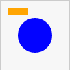
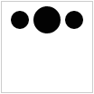

HTML, SVG, CSS, and Javascript: A Love Story
===================

This tutorial assumes you already have a brief understanding of HTML, basic programming concepts, and JavaScript. The contents of this introduction should largely be a refresher. If not, consider reading through some of these resources first:

* [Our Html Introduction](html.html)
* [Our Javascript D3 Introduction](javascript_d3.html)
* [Mozilla Developer Network - HTML Introduction](https://developer.mozilla.org/en-US/docs/Web/Guide/HTML/Introduction)
* [Mozilla Developer Network - JavaScript Resources](https://developer.mozilla.org/en-US/docs/Web/JavaScript)
 


HTML: Tags, Elements, and Attributes Oh, My!
--------------------------------------


Meet the paragraph element:

```markup
<p>Hello! I'm a paragraph element.</p>
```

### Tags
So let's break that down. There's clearly a sentence there: "Hello! I'm a paragraph element." But that sentence is wrapped in a `<p>...</p>`. Both of these are **tags**. The `<p>` is the _opening tag_, and the `</p>` is the _closing tag_ (the slash makes it a closing tag.)

### Elements
This sentence combined with the `<p>` and the `</p>` is an **element**. In this case, the element type is a `p`, which is a paragraph. This element tells a webbrowser that everything between the opening and closing tag is a paragraph, so the browser can apply the necessary style. By default, this typically means there's vertical spacing before and after.

### Attributes
Inside the _opening tag_ of any element can be an ***attribute***. These look like this:
```markup
<a href="http://www.google.com">This link goes to google</a>
```
First, this `<a>` tag is an anchor tag. This tag is used to create links in the document. 

See the `href="http://www.google.com"`? That is an attribute. It is used to give the element some special properties, which are aptly named attributes. These are generally key/value pairs. In this case, href (they key) contains the links destination (the value). 


These are the basic building blocks of HTML. 


Core HTML Structure
---------------

Every current webpage will have at least 5 key elements: `<!DOCTYPE html>`, `<html>`, `<head>`, `<title>`, and `<body>`. Here's an example:

```markup
<!DOCTYPE html>
<html>
	<head>
		<title>This is my favorite page</title>
	</head>
	<body>
		<p>This is the body of our page!</p>
	</body>
</html>
```

* `<!DOCTYPE html>` is always the first element on a page, and tells the browser that this page is HTML5. **Notice that it does not have a closing tag!** This is the first element we have seen like this, but there are several more.
* `<html>` is the wrapper around an html document.
* `<head>` is a special section that is used for key properties of the document.
* `<title>` is the title of the document. Since it does not change the page structure, it appears only in the `<head>`. 
* `<body>` is the core of the document itself. All of the visible HTML you see will appear within the `<body>` tag. 


SVG
=======

SVG is a language very similar to HTML, but unlike HTML is specifically meant for creating graphics. Thankfully, it can live within HTML as a special element. The `SVG` element. This would look like this:

```markup
<svg width="100" height="100">
	... SVG elements ...
<svg>
```

Notice that this has two attributes for width and height. It is important to explicitly specify both of these attributes and give the SVG element a size. Unlike HTML elements, it will not auto-adjust the size with the content inside of it. In this case, it will be 100 pixels wide and 100 pixels tall. 

So two of the key elements in SVG that you'll use are the `circle` and the `rect`. 

Bar Attributes (The most important ones)
<table class="table">
	<thead>
		<tr><th>Attribute Name</th><th>Description</th></tr>
	</thead>
	<tbody>
		<tr><td>x</td><td>X coordinate</td></tr>
		<tr><td>y</td><td>Y coordinate</td></tr>
		<tr><td>width</td><td>Width of rectangle</td></tr>
		<tr><td>height</td><td>Height of rectangle</td></tr>
		<tr><td>fill</td><td>Fill color name or HTML RGB notation</td></tr>
		<tr><td>stroke</td><td>Stroke/Outline color name or HTML RGB notation</td></tr>
	</tbody>
</table>

So to insert an SVG bar, the full code in HTML would look like this:
```markup
<svg width="100" height="100">
	<rect x="10" y="10" width="30" height="10" fill="orange" />
</svg>
```

--------
###Adding Elements By Hand


Now it's your turn. Let's add a blue circle to the SVG. The circle should be centered at (50,50) and should have a radius of 25 pixels. 

<a class="btn btn-default jsbin-button" href="http://jsbin.com/mopuwobobu/3/edit?html,output">Open in JS Bin</a>

Here's a table of some of the attributes:
<table class="table">
	<thead>
		<tr><th>Attribute Name</th><th>Description</th></tr>
	</thead>
	<tbody>
		<tr><td>cx</td><td>X coordinate of the center</td></tr>
		<tr><td>cy</td><td>Y coordinate of the center</td></tr>
		<tr><td>r</td><td>radius</td></tr>
		<tr><td>fill</td><td>Fill color name or HTML RGB notation</td></tr>
		<tr><td>stroke</td><td>Stroke/Outline color name or HTML RGB notation</td></tr>
		<tr><td>stroke-width</td><td>The width in pixels of the outline</td></tr>
	</tbody>
</table>


<div class="testing">

</div>

<div class="explore">
Here's a couple of other things you can try:
	<ul>
		<li>Change the colors of the `stroke` and `stroke-width`.</li>
		<li>Add a few lines to the image. [MDN Docs about the line element](https://developer.mozilla.org/en-US/docs/Web/SVG/Element/line).</li>
		<li>Create a face with the basic elements.</li>
	</ul>
</div>


D3
========

To make interactive visualzations, we have to use JavaScript to modify elements on the page. To simplify our lives, we'll use D3 to find specific elements and modify them. D3 uses a namespace like notation to hide all of its functionality. For example, all d3 functions begin with "d3". One of the first functions we'll find is `select` so to access this d3 function to help you find specific elements, we use ```d3.select```.  For example, `d3.select('circle')` will find the circle you just created. If you click on the `Console` button at the top right, you can test this yourself. You should see a lot of information displayed on the screen. 

<a class="btn btn-default jsbin-button" href="http://jsbin.com/mopuwobobu/5/edit?html,js,output">Open in JS Bin</a>

###Finding specific elements

Let's say you have 3 circles, and you only want to modify the middle one. How do you do that? The simplest way to do this is to add a special attribute called `id` to the 2nd circle. The value you give it is a string, and it must be unique in the entire document. 

```markup
<circle cx="20" cy="20" r="10" />
<circle cx="50" cy="20" r="10" id="middle-circle"/>
<circle cx="80" cy="20" r="10" />
```

In D3, you `select` this specific element by using this `id` in the select statement. To tell D3 we're trying to find an element with a specific `id` we prefix the name with a hash symbol (#). So in this example, we'd use:

```javascript
d3.select("#middle-circle");
```

`d3.select` returns what is called a *selection*. This gives us the first element that matches the filter you give it as an argument. In the above example, we used `#middle-circle` which matches the circle with the `id` value of "middle-circle". 

####Selecting all filtered elements

If you want to select more than one element, you can use the `d3.selectAll` function instead. For example, to select all circles we would use:

```
d3.selectAll("circle");
```


###Changing attributes

One of the key things we'll be doing with D3 is setting and changing the attributes of these elements. For example, when editing or creating a circle element, we need to set the position attributes (`cx` and `cy`)  as well as the radius (`r`). When making things interactive, you might simply want to change a value or add a new one. For example, if you want to set the color of the middle circle from the previous example, you would do:

```javascript
d3.select("#middle-circle").style("fill", "red");
```

###Interactivity

Now, let's change the elements when they're clicked. The following example has some code provided, and you need to add code to change the radius of the `circle` when clicked. The attribute for this is `r` and you can change the size to 15. To change an attribute in d3, you use the `attr` function on a selection.

<div class="testing">
To test, click on any of the circles. You should see something like this:



</div>


<div class="explore">
Here's a couple of other things you can try:
	<ul>
		<li>Move the circles when clicked.</li>
		<li>Set/remove the `stroke` (border) color on the `mouseenter` and `mouseout` events.</li>
		<li>Change the radius back when clicked a second time.</li>
	</ul>
</div>


