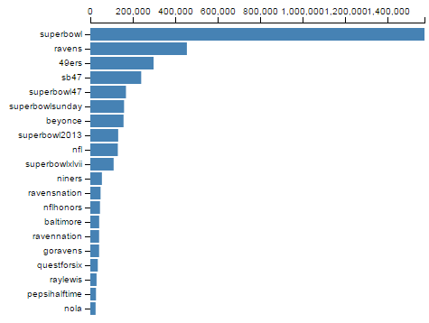

Building a Bar Chart
====================

We've just learned some of the basic features of D3
for building HTML elements and processing data.
In this tutorial, we will use some data that we've loaded
about Twitter hashtags to build a simple bar chart:



This visualization just shows the number of times each hashtag
was used over a given time interval.


1. Drawing a Visualization
--------------------------

How do we get from our hashtag data to a visualization?
Once we've loaded the data, we have to use D3 to draw a bunch of stuff
on the screen. Here are the basic steps we'll be following:

1. Read the data from CSV.
2. Create an SVG element to hold the visualization.
3. Define x and y scales.
4. Draw the x and y axes and labels.
5. For every hashtag in the data:
    1. Draw an SVG `<rect>` element
    2. Set the `y` position
    3. Set the width based on frequency

We already talked about loading data. You can review the code for
this in the JavaScript panel to the right.

<a class="btn btn-default jsbin-button" href="http://jsbin.com/rogab/64/edit?js,output">Open in JS Bin</a>

We have also already entered some CSS to make the bar chart look nice.
In the following sections, we will go through each of the steps above.


2. Create an SVG element
------------------------

Let's **add an SVG element to the page** to hold our visualization.
We should also decide at this point how big the visualization will be.

<a class="btn btn-default jsbin-button" href="http://jsbin.com/rogab/64/edit?js,output">Open in JS Bin</a>

Add the following to your JavaScript:

```javascript
var width = 500;
var height = 400;
var svg = d3.select('body')
  .append('svg')
  .attr('width', width)
  .attr('height', height);
```

This code uses `d3.select` to locate the `<body>` HTML element
and adds an `<svg>` element to it.

It then sets the `<svg>` element's `width` and `height` attributes
using variables.

You should see a box with a thin gray border appear.


3. Define the x and y scales
----------------------------

How do we convert from numbers in the data to visual variables, like
color, position, or size?

D3 provides some [scaling functions ](https://github.com/mbostock/d3/wiki/Scales) to help us with this task.
It defines the following major kinds of "scales":

- [Quantitative Scales](https://github.com/mbostock/d3/wiki/Quantitative-Scales) for continuous values.
    - linear scales: `d3.scale.linear()`
    - log scales: `d3.scale.log()`
    - power scales: `d3.scale.power()`
- [Ordinal Scales](https://github.com/mbostock/d3/wiki/Ordinal-Scales) for discrete values.
    - basic ordinal scales: `d3.scale.ordinal()`
    - color scale shortcuts: `d3.scale.category10()`
- [Time Scales](https://github.com/mbostock/d3/wiki/Time-Scales) for mapping time values.
    - multi-level time scales: `d3.time.scale()`

In this tutorial, we'll use `d3.scale.linear()` to map from
hashtag frequencies onto bar width. We'll also use `d3.scale.ordinal()`
to map hashtags to their vertical position in the bar chart.


### Find the domains

Before we can figure out how to map hashtag frequency onto
bar width, we need to know the min and max hashtag frequencies in the data.
D3 provides functions that make this easy.

<a class="btn btn-default jsbin-button" href="http://jsbin.com/rogab/65/edit?js,console">Open in JS Bin</a>

Add the following code:

```javascript
var max_tweets = d3.max(data, function(d) {
  return d.num_tweets;
});
```

The code above goes through all of the rows `d` in the data,
and finds the value of the `num_tweets` field for each row.
D3's `max()` function then returns the maximum value from that field (1571329).

We can add similar code to find the *smallest* value of `num_tweets` (24729):

```javascript
var min_tweets = d3.min(data, function(d) {
  return d.num_tweets;
});
```

Finally, we would like to have a list of all of the hashtags in the data,
so we will use the `map()` function to extract this field:

```javascript
var tag_names = data.map(function(d){
  return d.hashtag;
});
```

### Construct the scales

Now that we know the min and max of `num_tweets` and the
hashtags in our data, we are ready to create D3 scales.

Let's start with the x scale. The x scale should map
from the domain `[0, max_tweets]` onto the range
`[0, width]`.

Note that we are **not** using `min_tweets` here
because we want our bars to be based at zero.

Add this:

```javascript
var x = d3.scale.linear()
  .range([0, width])
  .domain([0, max_tweets]);
```

The `d3.scale.linear()` function produces an object
that we can actually call like a function.
You can try entering the following commands in the Console
window in JS Bin to see what you get:

```javascript
x(0)          //should return 0 (px)
x(200000)     //should return 63.64 (px)
x(max_tweets) //should return 500 (px)
```

Next, we will create an ordinal scale that maps hashtag
names onto vertical positions. This will use
a special D3 function `rangeRoundBands()` that
is useful for ensuring your bars get spaced out correctly:

```javascript
var y = d3.scale.ordinal()
  .domain(tag_names)
  .rangeRoundBands([ 0, height], 0.1);
```

As with `x`, you can call `y` like a function to
get the y-position for different hashtag bars.
Try this in the Console:

```javascript
y("superbowl")  //should return 11 (px)
y("baltimore")  //should return 258 (px)
```


4. Draw the axes
-----------------

Now we're ready to move on to drawing the axes.
We will use the D3 scales we created above to draw
the x and y axes in the visualization, along with axis labels.

D3 provides a utility specifically for drawing axes.
You give it a scale you've already created, tell it
whether it is drawing on the top, bottom, left, or right
of your chart, and it does the rest.

<a class="btn btn-default jsbin-button" href="http://jsbin.com/rogab/66/edit?js,output">Open in JS Bin</a>

The code below initializes an axis "renderer":

```javascript
var xAxis = d3.svg.axis()
  .scale(x)
  .orient("top");
```

We can then use the renderer to draw the SVG elements
that make up the axis with this code:

```javascript
svg.append("g")
  .classed("x axis", true)
  .call(xAxis);
```

**But where is the axis?**

You might see a small black line at the top of the SVG panel.
If you use the debugger to inspect the SVG element, you'll see that
it actually does contain new markup for the axis elements.
Unfortunately, they are off screen!

Elements rendering in the wrong place is a common problem with D3.
We'll fix that in the next step by adding some space
around the outside of our visualization.


### Add margins

We want to draw our visualization a little bit inside
the outside of the SVG element.
To do this, we need to *back up* a little bit and
change the way we set up the visualization.

<a class="btn btn-default jsbin-button" href="http://jsbin.com/rogab/67/edit?js,output">Open in JS Bin</a>

First, **find the code** where you start to define the x and y scales
(look for `var x = ...`). Right **before** that section, add the following:

```javascript
var margins = {
  top: 20,
  right: 20,
  bottom: 50,
  left: 110
};
var graphWidth = width - margins.right - margins.left;
var graphHeight = height - margins.top - margins.bottom;

var chart = svg.append('g')
  .attr('transform', 'translate(' + margins.left + ',' + margins.top + ')');

//this goes before you start to define the scales...
```

This sets up the margin sizes and adds a new SVG `<g>` (grouping) element
to the drawing. It also *transforms* the group element by shifting it
left and down using the margin sizes we configured above.
We will hang all of the visualization elements off this element.

Now we need to update a few other things now as well:

**Use graphWidth and graphHeight:** Look immediately below this, where you
define the scales (`var x =` and `var y =`).

In this section, you must replace `width` and `height`
with `graphWidth` and `graphHeight`, respectively.

**Append to chart:** Further down, find the code where you draw the x-axis.
Instead of using `svg.append`, you should change it to `chart.append`.

Finally, you should see your x-axis miraculously appear in view!


### Add the other axis

Ok, now we need to add the y-axis.
The code for this is very similar to what we used for the x-axis, so why don't you try this yourself?

<a class="btn btn-default jsbin-button" href="http://jsbin.com/rogab/68/edit?js,output">Open in JS Bin</a>

Note: you won't see a long black line for the y-axis like you do for the x-axis.
This is because of some special CSS styles that we added to make the chart look better.

If you get stuck, you can always click the JS Bin button in the next
section to skip ahead to the answer.


5. Draw some bars
-----------------

Ok that was a lot of work just to add axis labels.
It is finally time to draw some bars.

Remember the outline for this step that we gave
at the beginning:

*For every hashtag in the data:*

1. Draw an SVG `<rect>` element
2. Set the `y` position
3. Set the width based on frequency

If you have programmed in other languages, this might
seem like a place for a pretty straightforward for-loop.

But that's not how things are done in D3.
D3 uses something called a *join* to accomplish looping over data
and creating or altering many elements at once.

> The join is at the heart of what makes D3 powerful.
  If you are writing a loop, you are probably doing it wrong.

Here's the D3 way of rewriting the "algorithm" above:

1. Select all the `<rect>` elements, even if there aren't any yet.
2. Bind the hashtag data to the selection.
3. If there are excess data points, create new `<rect>` elements as needed.
4. If there are excess `<rect>` elements, delete them.
5. Update the `y` position and width of the remaining `<rect>` elements.

D3 is not the only language that works this way.
You might feel D3's way of thinking about loops is
somewhat similar to SQL, for example.

You can read more about D3 joins here:

* [Three Little Circles](http://strongriley.github.io/d3/tutorial/circle.html), an illustrative tutorial
* [Thinking with Joins](http://bost.ocks.org/mike/join/), a more thorough explanation

### Ok, now draw some bars

Enough theory. Let's go through these 5 steps with our bar chart.

<a class="btn btn-default jsbin-button" href="http://jsbin.com/rogab/69/edit?js,output">Open in JS Bin</a>

**Steps 1 and 2:** Add the following code:

```javascript
var bars = chart.selectAll('rect.bar')
                .data(data);
```

The first line above asks D3 to select some rectangles (with class "bar").
Note that there are *no such rectangles* anywhere on
the page yet. They are purely theoretical rectangles (**step 1**).

The second line joins this selection against our hashtag dataset (**step 2**).

**Step 3:** We know there are 20 hashtags in our dataset, but there
are 0 (zero) `<rect>` elements in our selection. Therefore, we
will ask D3 to create these missing elements:

```javascript
bars.enter()
    .append('rect')
    .attr('class', 'bar');
```

The key to this step is the `enter()` function, which roughly
translates to "do this for every excess data point".

**Step 4:** It just so happens that we do not have *any*
excess bars to delete. However, this is how we would ask D3 to do it:

```javascript
bars.exit()
    .remove();
```

Almost done. We now have `<rect>` elements on the visualization
(you can find them in the inspector), but we dont't see them
because we haven't set their position and size.

**Step 5:** Add this last crucial bit of code:

```javascript
bars.attr('x', 0)
    .attr('y', function(d) {
      return y(d.hashtag);
    })
    .attr('height', y.rangeBand())
    .attr('width', function(d) {
      return x(d.num_tweets);
    });
```

Let's break that down into sections.

The first line, `.attr('x', 0)` just ensures
that the left edge of each rectangle is at zero pixels.

Next, we set the `y` attribute with `.attr('y', function(d) {...})`.
D3 goes through every element and calls the provided function
with hashtag data matched to the element as the parameter `d`.
Inside that function, we use the y-scale object we created before
to translate the hashtag into a position.

The next line, `.attr('height', y.rangeBand())` sets the height
of each bar to some size that the y-scale object thinks is going
to make the bars look good. This is a magic D3 feature.

Finally, we set the width of each bar using the x-scale to
translate `num_tweets` into widths.

<a class="btn btn-default jsbin-button" href="http://jsbin.com/rogab/69/edit?js,output">Open in JS Bin</a>

The End
-------

That's all we're going to do with this visualization.
Below is a live copy:

<iframe class="embed-visualization" height="430" width="530" src="resources/twitter_barchart/barchart.html"></iframe>

